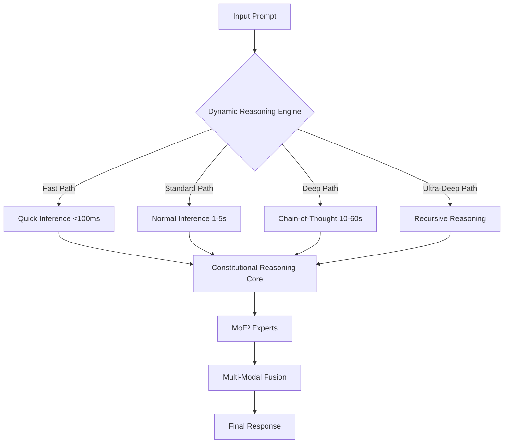

# 🌌 ULTRATHINK: GPT-5/Claude-4.1 Level AI System


> **ULTRATHINK** is a next-generation AI training pipeline inspired by **GPT-5** and **Claude 4.1**.
> It combines **dynamic reasoning**, **constitutional safety**, **expert mixtures**, and **multi-modal intelligence** into one unified framework.
> Designed for **scalability**, **efficiency**, and **responsible deployment**.

---

## ✨ Key Highlights

* ⚡ **Dynamic Reasoning Engine (DRE)** → Multiple reasoning depths (fast → ultra-deep) with complexity-aware routing.
* 🛡 **Constitutional Reasoning Core (CRC)** → Claude-style safety alignment with harm detection, critique, and self-revision.
* 🧠 **Advanced Mixture of Experts (MoE³)** → Hierarchical experts (knowledge, skill, meta, safety) with cross-expert attention.
* 🎨 **Multi-Modal Intelligence** → Text, code, vision, audio, and symbolic math.
* 🤝 **RLHF 2.0** → Direct Preference Optimization, process supervision, AI feedback.
* 🧪 **Synthetic Data Generation** → Chain-of-thought, adversarial, counterfactuals, curriculum-organized.
* 🖥 **4D Parallelism** → DP, TP, PP, EP (+ sequence parallelism) with ZeRO optimization.
* 📊 **Comprehensive Evaluation** → Reasoning, coding, knowledge, safety, and efficiency benchmarks.

---

## 🏗 Architecture Overview



---

## 📦 Installation

```bash
# Clone the repository
git clone https://github.com/yourusername/ultrathink.git
cd ultrathink

# Install dependencies
pip install -r requirements.txt

# (Optional) Install FlashAttention
pip install flash-attn --no-build-isolation
```

---

## 🚀 Quick Start

### 🔹 Train on a Single GPU

```bash
python train_ultrathink.py \
  --vocab_size 100352 \
  --hidden_size 4096 \
  --num_layers 32 \
  --batch_size 8 \
  --learning_rate 3e-5 \
  --enable_dre \
  --enable_constitutional \
  --enable_moe \
  --output_dir ./outputs/ultrathink
```

### 🔹 Distributed Training (DDP + 4D Parallelism)

```bash
torchrun --nproc_per_node=16 train_ultrathink.py \
  --distributed \
  --use_4d_parallelism \
  --data_parallel_size 2 \
  --tensor_parallel_size 2 \
  --pipeline_parallel_size 2 \
  --expert_parallel_size 2 \
  --zero_stage 3
```

### 🔹 RLHF Training

```bash
python train_ultrathink.py \
  --enable_rlhf \
  --rlhf_iterations 1000 \
  --ppo_epochs 4 \
  --ppo_batch_size 32
```

---

## ⚙️ Example Usage

```python
from src.models.ultrathink import UltraThinkConfig, UltraThinkModel
from src.enums import ReasoningPath, Modality

config = UltraThinkConfig(enable_dre=True, enable_moe=True, enable_multimodal=True)
model = UltraThinkModel(config)

# Force deep reasoning
output = model.generate(
    input_ids=input_ids,
    reasoning_path=ReasoningPath.DEEP,
    enforce_safety=True,
    max_new_tokens=1024
)

# Multi-modal example
inputs = {Modality.TEXT: text_tokens, Modality.IMAGE: image_tensor}
output = model.generate(inputs=inputs)
```

---

## 📊 Benchmarks

| Category          | Target      | Current    |
| ----------------- | ----------- | ---------- |
| **MMLU**          | >90%        | Training   |
| **GSM8K**         | >95%        | Training   |
| **HumanEval**     | >85%        | Training   |
| **Safety Score**  | >98%        | Training   |
| **Latency (P50)** | <100ms      | Optimizing |
| **Throughput**    | >1000 tok/s | Optimizing |

---

## 🛡 Safety Features

* ✅ Constitutional AI (self-critique + revision)
* ✅ Harm detection (violence, hate, PII, deception)
* ✅ Automatic refusal for harmful requests
* ✅ Real-time safety monitoring

---

## 🛣 Roadmap

<details>
<summary>🔹 Short-term (1-3 months)</summary>

* [ ] Pretrain on 1T+ tokens
* [ ] Implement FlashAttention 3
* [ ] Add 3D & video modalities
* [ ] Optimize inference speed

</details>

<details>
<summary>🔸 Medium-term (3-6 months)</summary>

* [ ] Scale to 100B+ parameters
* [ ] Add online learning
* [ ] Develop specialized domain experts

</details>

<details>
<summary>🔺 Long-term (6-12 months)</summary>

* [ ] Achieve GPT-5 level performance
* [ ] Deploy production system
* [ ] Implement continuous learning
* [ ] Open-source selected components

</details>

---

## 🤝 Contributing

We welcome contributions from the community!
Check out [CONTRIBUTING.md](CONTRIBUTING.md) for details.

---

## 📄 License

This project is released under the **MIT License**.
See [LICENSE](LICENSE) for more info.

---

## 🙏 Acknowledgments

* **OpenAI** → GPT architecture insights
* **Anthropic** → Constitutional AI principles
* **DeepMind** → MoE & reasoning methods
* **Open-source ML community** ❤️

---

> ⚠️ **Disclaimer**: ULTRATHINK is a research project.
> Use responsibly and ensure safety before deploying in real-world systems.
