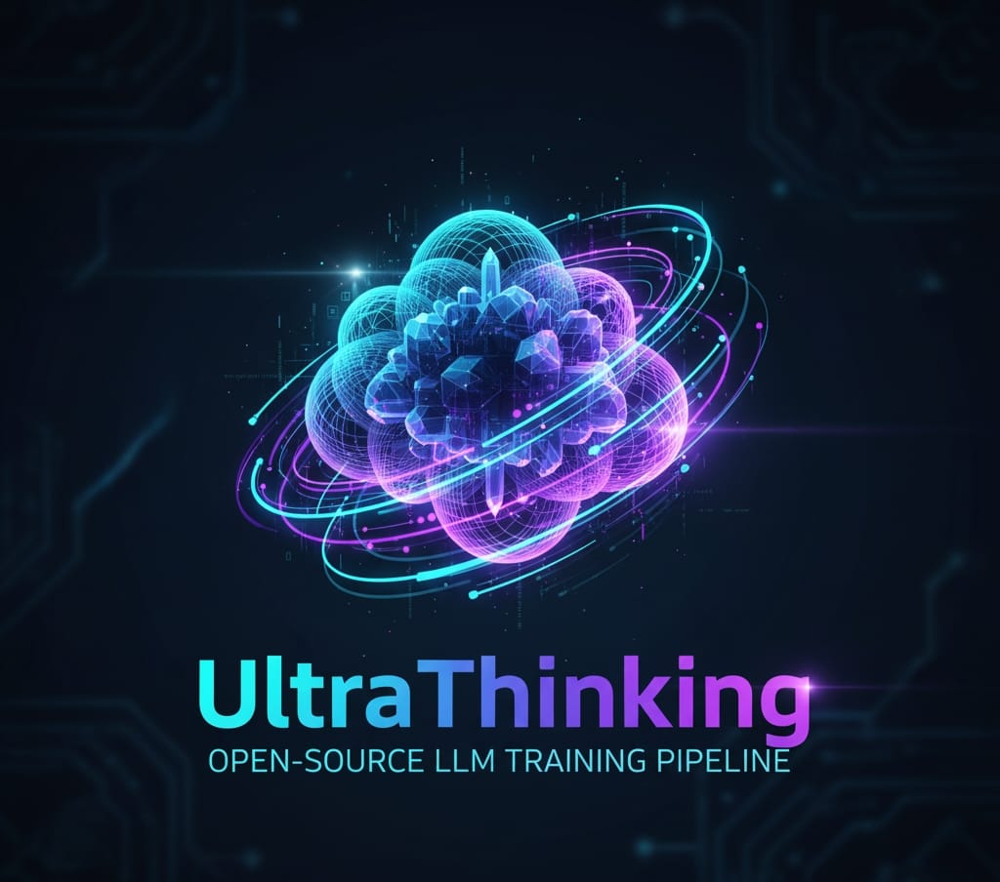

# ULTRATHINK
<p align="center">
  
</p>
<div align="center">

[](https://colab.research.google.com/github/vediyappanm/UltraThinking-LLM-Training/blob/main/deep/docs/colab.ipynb)
[](https://www.python.org/downloads/)
[](LICENSE)
[](https://discord.gg/ek2x9Rmk)
[](https://x.com/UltraThinkLLM)

</div>

**Production-ready training framework for advanced Large Language Models**

ULTRATHINK provides a complete, modular stack for training custom LLMs with state-of-the-art architectures, distributed training, and comprehensive monitoring. Built for researchers, engineers, and AI practitioners who want to train powerful language models with cutting-edge techniques.

## ✨ Key Features

- 🏗️ **Modern Architecture** - GQA, RoPE, SwiGLU, Flash Attention, RMSNorm
- 🧠 **Advanced Components** - Mixture-of-Experts, Dynamic Reasoning Engine, Constitutional AI
- 📊 **Production Monitoring** - MLflow, W&B, TensorBoard integration
- ⚡ **Optimized Training** - DeepSpeed ZeRO, FSDP, gradient checkpointing, AMP
- 🧪 **Fully Tested** - Unit & integration tests with pytest
- 🐳 **Docker Support** - Ready-to-use containers for training and inference
- 📚 **Complete Docs** - Step-by-step guides for all experience levels

## 🚀 Quick Start

### Installation

```bash
# Clone repository
git clone https://github.com/vediyappanm/UltraThinking-LLM-Training.git
cd UltraThinking-LLM-Training/deep

# Install dependencies
pip install -r requirements.txt
```

### Training Examples

**Tiny Model (CPU-friendly, for testing):**
```bash
python train_ultrathink.py \
  --dataset wikitext \
  --hidden_size 256 --num_layers 2 --num_heads 4 \
  --batch_size 2 --max_samples 1000 \
  --num_epochs 1
```

**Small Model (GPU recommended):**
```bash
python train_advanced.py --config configs/train_small.yaml
```

**With Advanced Features:**
```bash
python train_ultrathink.py \
  --dataset c4 --streaming \
  --hidden_size 768 --num_layers 12 --num_heads 12 \
  --enable_moe --enable_dre --enable_constitutional \
  --use_amp --gradient_checkpointing \
  --use_mlflow
```

### Docker

```bash
# Run Gradio web interface
docker compose up

# Or build and run manually
docker build -t ultrathink:latest .
docker run -p 7860:7860 ultrathink:latest
```

### Testing

```bash
# Run all tests
pytest

# Run with coverage
pytest --cov=src --cov-report=html

# Quick smoke test
python tests/smoke_test.py
```

## 📚 Documentation

### Essential Guides
- **[Training Quickstart](TRAINING_QUICKSTART.md)** - Get started in 5 minutes
- **[Advanced Training Guide](ADVANCED_TRAINING_GUIDE.md)** - Deep dive into all features
- **[Project Structure](PROJECT_STRUCTURE.md)** - Understanding the codebase
- **[Architecture Overview](ARCHITECTURE_OVERVIEW.md)** - Visual system diagrams
- **[Model Card](MODEL_CARD.md)** - Model specifications and benchmarks

### Training Guides
- [Small Models](docs/training_small.md) - Train on limited hardware
- [DeepSpeed Integration](docs/training_deepspeed.md) - Distributed training setup
- [Dataset Configuration](docs/datasets.md) - Using custom datasets
- [Google Colab](docs/colab.md) - Train in the cloud for free

### Community
- **[Contributing](CONTRIBUTING.md)** - Contribution guidelines
- **[Code of Conduct](CODE_OF_CONDUCT.md)** - Community standards
- **[Changelog](CHANGELOG.md)** - Version history

**[📖 Full Documentation Index](docs/README.md)**

## 📁 Project Structure

```
deep/
├── train_ultrathink.py        # Main training script
├── train_advanced.py          # YAML config-based training
├── app_gradio.py              # Web UI for inference
├── src/
│   ├── models/               # UltraThink, MoE, DRE, architecture
│   ├── data/                 # Datasets, tokenization, validation
│   ├── training/             # Optimizers, distributed, RLHF
│   ├── monitoring/           # Metrics and system monitoring
│   ├── security/             # Input validation and safety
│   └── evaluation/           # Benchmarks and metrics
├── tests/                    # Unit and integration tests
├── configs/                  # YAML configuration files
├── scripts/                  # Utilities (profiling, inference)
└── docs/                     # Documentation and guides
```

See **[PROJECT_STRUCTURE.md](PROJECT_STRUCTURE.md)** for detailed explanations.

## 🔥 Training Examples

### Small Dataset Training
```bash
# WikiText-2 (fast iteration)
python train_ultrathink.py \
  --dataset wikitext \
  --hidden_size 512 --num_layers 6 --num_heads 8 \
  --batch_size 4 --num_epochs 3 \
  --use_mlflow
```

### Production Training (C4 Dataset)
```bash
# Streaming C4 with all optimizations
python train_ultrathink.py \
  --dataset c4 --dataset_subset en --streaming \
  --hidden_size 768 --num_layers 12 --num_heads 12 \
  --batch_size 2 --gradient_accumulation_steps 64 \
  --learning_rate 3e-4 --warmup_steps 5000 \
  --use_amp --gradient_checkpointing \
  --max_seq_length 1024 \
  --output_dir ./outputs/c4_production
```

### Using Configuration Files
```bash
# Small model (4-8GB GPU)
python train_advanced.py --config configs/train_small.yaml

# Medium model (16-32GB GPU)
python train_advanced.py --config configs/train_medium.yaml

# Large model (40GB+ GPU)
python train_advanced.py --config configs/train_large.yaml
```

## 🐳 Docker Usage

**Web Interface (Gradio):**
```bash
docker compose up
# Visit http://localhost:7860
```

**Custom Training:**
```bash
docker run -v $(pwd)/outputs:/app/outputs ultrathink:latest \
  python train_ultrathink.py \
    --dataset wikitext \
    --hidden_size 256 --num_layers 2 \
    --output_dir /app/outputs/my_model
```

**GPU Training:**
```bash
docker run --gpus all \
  -v $(pwd)/outputs:/app/outputs \
  ultrathink:latest \
  python train_ultrathink.py --use_amp
```

## 🤝 Contributing

We welcome contributions! Please see:
- **[CONTRIBUTING.md](CONTRIBUTING.md)** - Guidelines and setup
- **[CODE_OF_CONDUCT.md](CODE_OF_CONDUCT.md)** - Community standards

## 🌐 Community & Support

Join our growing community:

- **💬 [Discord](https://discord.gg/ek2x9Rmk)** - Get help, share projects, discuss ideas
- **🐦 [Twitter/X](https://x.com/UltraThinkLLM)** - Latest updates and announcements
- **🐛 [GitHub Issues](https://github.com/vediyappanm/UltraThinking-LLM-Training/issues)** - Report bugs or request features
- **💡 [Discussions](https://github.com/vediyappanm/UltraThinking-LLM-Training/discussions)** - Ask questions and share knowledge

## 📊 Model Specifications

| Size | Parameters | Layers | Hidden | Context | Min GPU |
|------|-----------|--------|--------|---------|---------|
| Tiny | 125M | 12 | 768 | 2048 | 6GB |
| Small | 350M | 24 | 1024 | 4096 | 16GB |
| Medium | 760M | 24 | 1536 | 4096 | 24GB |
| Large | 1.3B | 32 | 2048 | 8192 | 40GB |

See **[MODEL_CARD.md](MODEL_CARD.md)** for complete specifications.

## 📄 License

MIT License - see [LICENSE](LICENSE) for details.

## 🙏 Citation

```bibtex
@software{ultrathink2025,
  title={ULTRATHINK: Advanced LLM Training Framework},
  author={ULTRATHINK Team},
  year={2025},
  url={https://github.com/vediyappanm/UltraThinking-LLM-Training}
}
```
