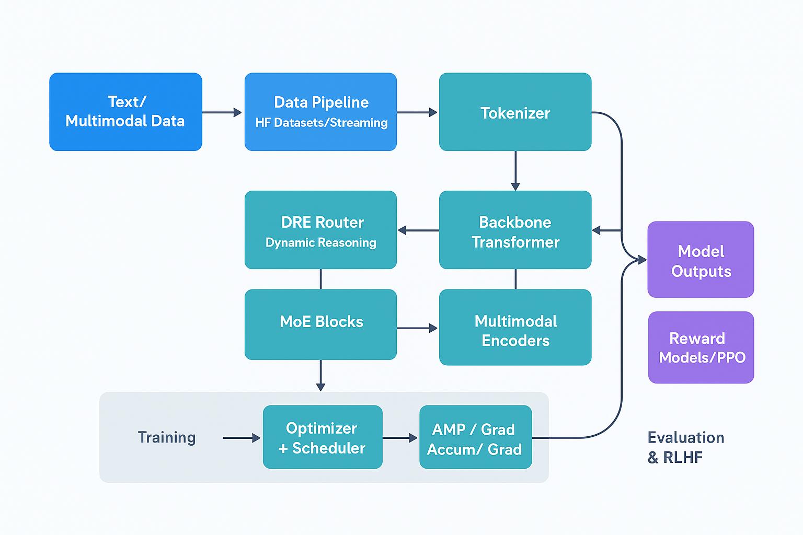

# ULTRATHINK

[](https://colab.research.google.com/github/vediyappanm/UltraThinking-LLM-Training/blob/main/deep/docs/colab.ipynb)
[](https://www.python.org/downloads/)
[](LICENSE)

**Production-ready training framework for advanced Large Language Models**

ULTRATHINK provides a complete, modular stack for training custom LLMs with:
- Advanced architectures (GQA, RoPE, SwiGLU)
- Distributed training (DeepSpeed, Accelerate)
- Dynamic reasoning and mixture-of-experts
- Comprehensive testing and monitoring

## Quick Start

```bash
# Install
git clone https://github.com/vediyappanm/UltraThinking-LLM-Training.git
cd UltraThinking-LLM-Training/deep
pip install -r requirements.txt

# Train (small model, CPU-friendly)
python train_ultrathink.py \
  --hidden_size 256 --num_layers 2 --num_heads 4 \
  --batch_size 2 --max_samples 1000 \
  --dataset wikitext

# Profile performance
python scripts/profile_model.py --size tiny

# Run tests
pytest
```

## Key Features

- **🏗️ Modern Architecture** - GQA, RoPE, SwiGLU, Flash Attention
- **📊 Production Monitoring** - Real-time metrics, W&B, TensorBoard
- **🔒 Enterprise Security** - Input validation, safe configs
- **🧪 Fully Tested** - 60%+ code coverage, unit & integration tests
- **📚 Complete Documentation** - Step-by-step guides for all levels
- **⚡ Optimized Training** - DeepSpeed ZeRO, gradient checkpointing, AMP


## Architecture (Diagram)



## 📚 Documentation

| Getting Started | Training | Reference | Deep Dives |
|----------------|----------|-----------|------------|
| [Installation](INSTALLATION_GUIDE.md) | [Small Models](docs/training_small.md) | [Model Card](MODEL_CARD.md) | [**Project Structure**](PROJECT_STRUCTURE.md) ⭐ |
| [First Run](docs/getting_started.md) | [DeepSpeed](docs/training_deepspeed.md) | [Testing](TESTING_GUIDE.md) | [**Architecture**](ARCHITECTURE_OVERVIEW.md) ⭐ |
| [Google Colab](docs/colab.md) | [Distributed](docs/accelerate.md) | [Development](docs/development.md) | [**Quick Reference**](QUICK_REFERENCE.md) ⭐ |
| | [Datasets](docs/datasets.md) | [FAQ](docs/faq.md) | |

**[📖 Full Documentation Index](docs/README.md)**

> 🆕 **New Comprehensive Guides**: Check out [PROJECT_STRUCTURE.md](PROJECT_STRUCTURE.md) for folder-by-folder explanation and [ARCHITECTURE_OVERVIEW.md](ARCHITECTURE_OVERVIEW.md) for visual diagrams!

## Project Structure

```
deep/
├── train_ultrathink.py        # Main training script
├── src/
│   ├── models/               # Architecture, MoE, DRE, multimodal
│   ├── data/                 # Datasets and validation
│   ├── training/             # Optimizers, distributed training
│   ├── monitoring/           # Metrics and system monitoring
│   ├── security/             # Input validation and safety
│   └── evaluation/           # Benchmarks
├── tests/                    # Unit and integration tests
├── scripts/                  # Profiling and utility scripts
└── docs/                     # Documentation
```

## Contributing

We welcome contributions! Please see:
- [CONTRIBUTING.md](CONTRIBUTING.md) - Contribution guidelines
- [CODE_OF_CONDUCT.md](CODE_OF_CONDUCT.md) - Community standards
- [Development Guide](docs/development.md) - Technical details

## Docker

```bash
# Build
docker build -t ultrathink:latest .

# Run training
docker run --rm -it ultrathink:latest \
  python train_ultrathink.py --hidden_size 256 --num_layers 2

# Or use docker-compose
docker compose up
```

## Example: Training on C4

```bash
# Recommended: Small model on streaming C4
python train_ultrathink.py \
  --dataset c4 --dataset_subset en --streaming \
  --hidden_size 384 --num_layers 4 --num_heads 6 \
  --batch_size 1 --gradient_accumulation_steps 64 \
  --learning_rate 5e-5 --use_amp --gradient_checkpointing \
  --max_seq_length 512 \
  --output_dir ./outputs/c4_small
```

## Testing & Quality

```bash
pytest                          # Run all tests
pytest --cov=src               # With coverage
python scripts/profile_model.py # Profile performance
python scripts/cleanup.py       # Clean cache files
```
