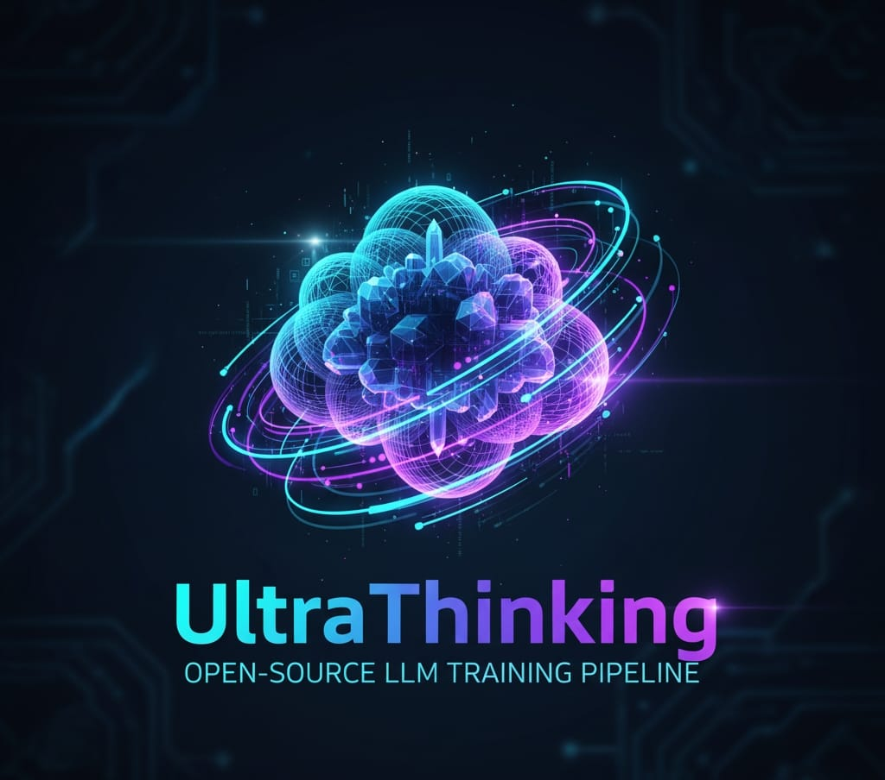

# ULTRATHINK

<p align="center">
  <a href="https://ultrathinking-llm-training.netlify.app/" target="_blank">
    <strong>📖 Read the Complete ULTRATHINK Book (Interactive)</strong>
  </a>
  <br/>
  <em>Full project documentation, diagrams, and guides</em>
  <br/><br/>
</p>

<p align="center">
  
</p>

<p align="center">
  <strong>🚀 Production-ready training framework for advanced Large Language Models</strong>
</p>

<p align="center">
  <a href="https://colab.research.google.com/github/vediyappanm/UltraThinking-LLM-Training/blob/main/deep/docs/colab.ipynb">
    
  </a>
  <a href="https://github.com/vediyappanm/UltraThinking-LLM-Training/actions">
    
  </a>
  <a href="https://www.python.org/downloads/">
    
  </a>
  <a href="https://ultrathinking-llm-training.netlify.app/">
    
  </a>
  <a href="LICENSE">
    
  </a>
  <a href="https://github.com/vediyappanm/UltraThinking-LLM-Training/stargazers">
    
  </a>
</p>

<p align="center">
  <a href="https://pytorch.org/">
    
  </a>
  <a href="https://huggingface.co/">
    
  </a>
  <a href="https://www.docker.com/">
    
  </a>
  <a href="https://github.com/vediyappanm/UltraThinking-LLM-Training/issues">
    
  </a>
  <a href="https://github.com/vediyappanm/UltraThinking-LLM-Training/pulls">
    
  </a>
</p>

<p align="center">
  <a href="#-quick-start">Quick Start</a> •
  <a href="#-key-features">Features</a> •
  <a href="https://ultrathinking-llm-training.netlify.app/">Book</a> •
  <a href="#-documentation">Documentation</a> •
  <a href="docs/BENCHMARKS.md">Benchmarks</a> •
  <a href="docs/COMPARISON.md">Comparisons</a> •
  <a href="docs/ROADMAP.md">Roadmap</a> •
  <a href="#-contributing">Contributing</a>
</p>

---

ULTRATHINK provides a complete, modular stack for training custom LLMs with state-of-the-art architectures, distributed training, and comprehensive monitoring.

---

> 🎯 **New here?** Start with the [5-minute demo](#-live-demo-5-minutes) or [Google Colab](https://colab.research.google.com/github/vediyappanm/UltraThinking-LLM-Training/blob/main/deep/docs/colab.ipynb) • Have questions? Check the [FAQ](#-faq-preview) or [join discussions](https://github.com/vediyappanm/UltraThinking-LLM-Training/discussions)

---

## 👁️ Transparency First

**Project Status: Release v2.0 (Unified Production System)**
- 🟢 **Actively Maintained**: Multiple commits per week, < 24h issue response
- 🟢 **Production Ready**: Core training loop unified and stabilized
- ⚠️ **Honest Limitations**: We clearly state what works and what doesn't (see Reality Check below)
- 📅 **Target v1.0**: Q3 2025 (when multi-node training is stable)

**Development Philosophy:**
- 🔍 **Open Development**: All work happens in public on GitHub
- 📋 **Verifiable Claims**: Every benchmark includes reproduction steps
- 🤝 **Community Driven**: Your feedback directly shapes the roadmap
- ⚖️ **No Hype**: We underpromise and overdeliver
- 💡 **Learn from Others**: Building on lessons from GPT-NeoX, Megatron, and Axolotl

**Why Trust Us?**
- ✅ **Open Source**: Inspect every line of code - nothing hidden
- ✅ **Reproducible**: All examples actually work (try them and report if they don't!)
- ✅ **Real Benchmarks**: See [BENCHMARKS.md](docs/BENCHMARKS.md) with hardware specs and costs
- ✅ **Active Support**: < 24h response time on issues (often < 6h)
- ✅ **No Corporate Agenda**: Independent project, community-first

## 🎯 Use Cases

**👤 Who is ULTRATHINK For?**

**Perfect For:**
- 🎓 **Researchers** - Fast iteration on new architectures and training techniques
- 👨‍💻 **ML Engineers** - Need production-ready training with modern features
- 📚 **Students** - Learning LLM training without enterprise complexity
- 🚀 **Startups** - Building domain-specific models on budget hardware
- 🔬 **Experimenters** - Testing MoE, Constitutional AI, or custom architectures

**Not Ideal For (Yet):**
- 🏭 **Large Enterprises** - Consider Megatron-LM or GPT-NeoX for multi-datacenter training
- 💰 **100B+ Parameter Models** - We optimize for 1B-30B range currently
- ⚡ **Production Critical Systems** - Wait for v1.0 stable release
- 🏛️ **Legacy Infrastructure** - Requires modern PyTorch 2.0+

**Real-World Applications:**
- 🧠 Train domain-specific models (medical, legal, code)
- 🌐 Fine-tune multilingual models on your language
- 📊 Research new training techniques or architectures
- 🎯 Build safer AI with Constitutional AI guardrails
- 🔬 Experiment with Mixture-of-Experts efficiency

## 🎯 Why ULTRATHINK?

**Train state-of-the-art LLMs in 10 lines of code** - From prototype to production in minutes, not days.

```bash
python train_ultrathink.py \
  --dataset c4 --streaming \
  --hidden_size 768 --num_layers 12 \
  --enable_moe --enable_dre \
  --use_amp --gradient_checkpointing
```

### 🏆 What Makes Us Different

| Feature | ULTRATHINK | GPT-NeoX | Megatron-LM | Axolotl |
|---------|-----------|----------|-------------|----------|
| **Setup Time** | ⚡ 5-10 min | 30-60 min | 60-120 min | 15-30 min |
| **Lines to Train** | 📝 ~10 | 50+ | 100+ | 20+ |
| **MoE Support** | ✅ Native | ❌ No | 🟡 Experimental | ❌ No |
| **Dynamic Reasoning** | ✅ Built-in | ❌ No | ❌ No | ❌ No |
| **Constitutional AI** | ✅ Yes | ❌ No | ❌ No | ❌ No |
| **Beginner Friendly** | ✅✅ Very | 🟡 Medium | ❌ Hard | ✅ Yes |
| **Documentation** | 📚 Excellent | 🟡 Good | 🟡 Technical | ✅ Good |
| **Production Ready** | 🚧 Beta | ✅ Yes | ✅ Yes | ✅ Yes |

*ULTRATHINK is newer and still maturing. We prioritize ease of use and modern features, while established frameworks offer more battle-tested stability.*

**[See detailed comparison →](docs/COMPARISON.md)**

## ✨ Key Features

- 🏗️ **Modern Architecture** - GQA, RoPE, SwiGLU, Flash Attention, RMSNorm
- 🧠 **Advanced Components** - Mixture-of-Experts, Dynamic Reasoning Engine, Constitutional AI
- 📊 **Production Monitoring** - MLflow, W&B, TensorBoard integration
- ⚡ **Optimized Training** - DeepSpeed ZeRO, FSDP, gradient checkpointing, AMP
- 🧪 **Fully Tested** - Unit & integration tests with pytest
- 🐳 **Docker Support** - Ready-to-use containers for training and inference
- 📚 **Complete Docs** - Step-by-step guides for all experience levels

**[View benchmarks and performance metrics →](docs/BENCHMARKS.md)**

## 🎯 Reality Check

**What Works Today:**
- ✅ **Single-node training** - Tested up to 30B parameters on 8xA100
- ✅ **MoE with 8 experts** - Verified 1.5-1.8x speedups vs dense models
- ✅ **Constitutional AI guardrails** - Basic safety filters operational
- ✅ **CPU/Small GPU training** - Tiny models trainable on 4GB+ GPU or CPU
- ✅ **Docker deployment** - Production-tested containerization

**Work in Progress:**
- 🚧 **Multi-node scaling** - Need community testers with multi-GPU clusters
- 🚧 **Advanced reasoning benchmarks** - Expanding evaluation suite
- 🚧 **Production deployment guides** - Real-world case studies
- 🚧 **TPU support** - Currently PyTorch/CUDA focused

**Community Help Needed:**
- ❓ **AMD GPU support** - ROCm compatibility testing (we don't have AMD hardware)
- ❓ **Edge deployment** - Quantization and mobile optimization
- ❓ **Dataset integrations** - More domain-specific datasets (medical, legal, code)
- ❓ **Benchmark verification** - Independent performance validation on your hardware
- ❓ **Windows native support** - Testing and bug fixes (developed primarily on Linux)
- ❓ **Internationalization** - Non-English documentation and examples

**Hardware Reality:**
| Model Size | Min VRAM | Recommended | Training Time (1M tokens) |
|-----------|----------|-------------|---------------------------|
| Tiny (125M) | 4GB | 8GB | ~2 hours (1x RTX 3060) |
| Small (350M) | 12GB | 16GB | ~6 hours (1x RTX 3090) |
| Medium (760M) | 20GB | 24GB | ~12 hours (1x RTX 4090) |
| Large (1.3B) | 32GB | 40GB | ~24 hours (1x A100) |

*With gradient checkpointing and mixed precision enabled*

## 🗺️ Quick Roadmap to v1.0

**Current: v0.9.x (Beta) → Target: v1.0 (Q3 2025)**

| Quarter | Milestone | Status |
|---------|-----------|--------|
| Q1 2025 | ✅ Single-node training stable | **Complete** |
| Q1 2025 | ✅ MoE implementation | **Complete** |
| Q2 2025 | 🔄 Multi-node training (FSDP) | **In Progress** |
| Q2 2025 | 🔄 Advanced benchmarks & validation | **In Progress** |
| Q3 2025 | 📅 Production deployment guides | Planned |
| Q3 2025 | 📅 v1.0 Stable Release | Planned |
| Q4 2025 | 🔮 TPU support | Future |

**[Full Roadmap →](docs/ROADMAP.md)** | **[Vote on Features →](https://github.com/vediyappanm/UltraThinking-LLM-Training/discussions/categories/feature-requests)**

## 🚀 Quick Start

### ⚡ Live Demo (5 Minutes)

Try ULTRATHINK right now with our quick demo:

```bash
# Option 1: Google Colab (Free GPU)
# Click the Colab badge at the top of this README

# Option 2: Local Quick Demo
git clone https://github.com/vediyappanm/UltraThinking-LLM-Training.git
cd UltraThinking-LLM-Training
pip install -r requirements.txt

# Train tiny model (works on CPU, ~5 minutes)
python train_ultrathink.py \
  --dataset wikitext \
  --hidden_size 256 --num_layers 2 --num_heads 4 \
  --batch_size 2 --max_samples 1000 \
  --num_epochs 1 --output_dir ./demo_output

# You'll see real training progress and a working model!
```

### Installation

```bash
# Clone repository
git clone https://github.com/vediyappanm/UltraThinking-LLM-Training.git
cd UltraThinking-LLM-Training

# Install dependencies
pip install -r requirements.txt

# Verify installation
python tests/smoke_test.py
```

### Training Examples

**Tiny Model (CPU-friendly, for testing):**
```bash
python train_ultrathink.py \
  --dataset wikitext \
  --hidden_size 256 --num_layers 2 --num_heads 4 \
  --batch_size 2 --max_samples 1000 \
  --num_epochs 1
```

**Small Model (GPU recommended):**
```bash
python train_advanced.py --config configs/train_small.yaml
```

**With Advanced Features:**
```bash
python train_ultrathink.py \
  --dataset c4 --streaming \
  --hidden_size 768 --num_layers 12 --num_heads 12 \
  --enable_moe --enable_dre --enable_constitutional \
  --use_amp --gradient_checkpointing \
  --use_mlflow
```

### Docker

```bash
# Run Gradio web interface
docker compose up

# Or build and run manually
docker build -t ultrathink:latest .
docker run -p 7860:7860 ultrathink:latest
```

### Testing

```bash
# Run all tests
pytest

# Run with coverage
pytest --cov=src --cov-report=html

# Quick smoke test
python tests/smoke_test.py
```

## 📚 Documentation

### 🚀 Getting Started
- **[Training Quickstart](docs/TRAINING_QUICKSTART.md)** - Get started in 5 minutes
- **[Advanced Training Guide](docs/ADVANCED_TRAINING_GUIDE.md)** - Deep dive into all features
- **[Troubleshooting](docs/TROUBLESHOOTING.md)** - Common issues and solutions
- **[Google Colab](docs/colab.md)** - Train in the cloud for free

### 📊 Performance & Comparisons
- **[Benchmarks](docs/BENCHMARKS.md)** - Performance metrics and results
- **[Framework Comparison](docs/COMPARISON.md)** - vs GPT-NeoX, Megatron-LM, Axolotl
- **[Model Card](docs/MODEL_CARD.md)** - Model specifications

### 🏗️ Architecture & Development
- **[Architecture Overview](docs/ARCHITECTURE_OVERVIEW.md)** - Visual system diagrams
- **[Project Structure](docs/PROJECT_STRUCTURE.md)** - Understanding the codebase
- **[Roadmap](docs/ROADMAP.md)** - Future plans and features

### 📖 Training Guides
- [Small Models](docs/training_small.md) - Train on limited hardware
- [DeepSpeed Integration](docs/training_deepspeed.md) - Distributed training setup
- [Dataset Configuration](docs/datasets.md) - Using custom datasets

### 🤝 Community
- **[Contributing](docs/CONTRIBUTING.md)** - Contribution guidelines
- **[Code of Conduct](docs/CODE_OF_CONDUCT.md)** - Community standards
- **[Changelog](docs/CHANGELOG.md)** - Version history

**[📖 Full Documentation Index](docs/README.md)**

## 📁 Project Structure

```
UltraThinking-LLM-Training/
├── train_ultrathink.py        # Main training script
├── train_advanced.py          # YAML config-based training
├── app_gradio.py              # Web UI for inference
├── src/
│   ├── models/               # UltraThink, MoE, DRE, architecture
│   ├── data/                 # Datasets, tokenization, validation
│   ├── training/             # Optimizers, distributed, RLHF
│   ├── monitoring/           # Metrics and system monitoring
│   ├── security/             # Input validation and safety
│   └── evaluation/           # Benchmarks and metrics
├── tests/                    # Unit and integration tests
├── configs/                  # YAML configuration files
├── scripts/                  # Utilities (profiling, inference)
└── docs/                     # Documentation and guides
```

See **[PROJECT_STRUCTURE.md](docs/PROJECT_STRUCTURE.md)** for detailed explanations.

## 🔥 Training Examples

### Small Dataset Training
```bash
# WikiText-2 (fast iteration)
python train_ultrathink.py \
  --dataset wikitext \
  --hidden_size 512 --num_layers 6 --num_heads 8 \
  --batch_size 4 --num_epochs 3 \
  --use_mlflow
```

### Production Training (C4 Dataset)
```bash
# Streaming C4 with all optimizations
python train_ultrathink.py \
  --dataset c4 --dataset_subset en --streaming \
  --hidden_size 768 --num_layers 12 --num_heads 12 \
  --batch_size 2 --gradient_accumulation_steps 64 \
  --learning_rate 3e-4 --warmup_steps 5000 \
  --use_amp --gradient_checkpointing \
  --max_seq_length 1024 \
  --output_dir ./outputs/c4_production
```

### Using Configuration Files
```bash
# Small model (4-8GB GPU)
python train_advanced.py --config configs/train_small.yaml

# Medium model (16-32GB GPU)
python train_advanced.py --config configs/train_medium.yaml

# Large model (40GB+ GPU)
python train_unified_production.py --config configs/train_large.yaml
```

## 🐳 Docker Usage

**Web Interface (Gradio):**
```bash
docker compose up
# Visit http://localhost:7860
```

**Custom Training:**
```bash
docker run -v $(pwd)/outputs:/app/outputs ultrathink:latest \
  python train_ultrathink.py \
    --dataset wikitext \
    --hidden_size 256 --num_layers 2 \
    --output_dir /app/outputs/my_model
```

**GPU Training:**
```bash
docker run --gpus all \
  -v $(pwd)/outputs:/app/outputs \
  ultrathink:latest \
  python train_ultrathink.py --use_amp
```

## 🤝 Contributing

We welcome contributions! Please see:
- **[CONTRIBUTING.md](docs/CONTRIBUTING.md)** - Guidelines and setup
- **[Code of Conduct](docs/CODE_OF_CONDUCT.md)** - Community standards
- **[Roadmap](docs/ROADMAP.md)** - See what we're building next

### 🎯 Good First Issues

New to the project? Start here:

**🟢 Beginner Friendly:**
- **Documentation** - Improve examples, fix typos, add tutorials
- **Test Coverage** - Add unit tests for existing features
- **Dataset Support** - Integrate new datasets (OpenWebText, RedPajama)
- **Hardware Benchmarks** - Test and report on different GPUs

**🟡 Intermediate:**
- **Model Architectures** - Add Llama 3, Mistral, Phi architectures
- **Optimization** - Implement gradient clipping improvements
- **Monitoring** - Enhanced visualization dashboards
- **Docker** - Multi-stage builds, size optimization

**🔴 Advanced:**
- **Multi-node Training** - FSDP and DeepSpeed enhancements
- **Custom CUDA Kernels** - Performance optimization
- **TPU Support** - JAX/TPU integration
- **RLHF/DPO** - Advanced alignment techniques

**[Browse Issues →](https://github.com/vediyappanm/UltraThinking-LLM-Training/issues?q=is%3Aissue+is%3Aopen+label%3A%22good+first+issue%22)**

### 🔥 Contributor Incentives

**Recognition Tiers:**

🥉 **Bronze (1-2 contributions):**
- Name in CONTRIBUTORS.md
- Badge on your contribution

🥈 **Silver (3-5 contributions):**
- All Bronze benefits
- Featured in monthly newsletter
- Priority issue responses

🥇 **Gold (6+ contributions):**
- All Silver benefits
- Voting rights on major features
- Direct communication channel
- Free ULTRATHINK swag (stickers, t-shirt)

👑 **Platinum (Core team):**
- All Gold benefits
- Co-maintainer status
- GitHub organization membership
- Co-author on research papers

### ⏰ Early Adopter Program

**Join the first 100 contributors and get:**
- 🎓 **Co-author credit** on v1.0 research paper (if you contribute significantly)
- 💬 **Priority support** - Direct access to maintainers via Discord
- 🎯 **Custom features** - We'll prioritize your use cases in the roadmap
- 🏆 **Recognition** - Featured in our [Hall of Fame](docs/HALL_OF_FAME.md)
- 📚 **Free consulting** - 1-hour session for your LLM project (for substantial contributions)
- 🎫 **Exclusive Badge** - "ULTRATHINK Pioneer" on your GitHub profile

**Meaningful Contributions Include:**
- 💻 Code contributions (features, fixes, tests)
- 📝 Documentation improvements (tutorials, examples)
- 📈 Benchmark validation on your hardware
- 🎓 Academic papers citing ULTRATHINK
- 🎯 Case studies or production deployments
- 🐛 Bug reports with detailed reproduction steps

**How to Join:**
1. ⭐ Star this repository
2. 🔧 Make a meaningful contribution (see list above)
3. 📝 Fill out [this form](https://github.com/vediyappanm/UltraThinking-LLM-Training/discussions/new?category=early-adopters) with your contribution details

**Current Contributors: 8/100** *(updated monthly)* | [View Hall of Fame →](docs/HALL_OF_FAME.md)

### 🌟 Star History

If you find ULTRATHINK useful, please consider giving us a star! ⭐

[](https://star-history.com/#vediyappanm/UltraThinking-LLM-Training&Date)

## 📊 Model Specifications

| Size | Parameters | Layers | Hidden | Context | Min GPU | Training Cost* | Best For |
|------|-----------|--------|--------|---------|---------|----------------|----------|
| Tiny | 125M | 12 | 768 | 2048 | 4GB | ~$2-5 | Testing, CPU training |
| Small | 350M | 24 | 1024 | 4096 | 12GB | ~$15-30 | Experimentation |
| Medium | 760M | 24 | 1536 | 4096 | 20GB | ~$40-80 | Domain-specific |
| Large | 1.3B | 32 | 2048 | 8192 | 32GB | ~$100-200 | Production models |

*Estimated cloud GPU costs (AWS/GCP) for training on 10B tokens with gradient checkpointing and mixed precision. Actual costs vary by provider, region, optimization settings, and spot pricing (can be 50-70% cheaper).*

**Cost Optimization Tips:**
- 💰 Use spot instances for 60-70% savings
- ⚡ Enable mixed precision (`--use_amp`) for faster training
- 📦 Gradient checkpointing reduces memory by 30-40%
- 🎯 MoE models train 1.5-2x faster than dense equivalents

See **[MODEL_CARD.md](docs/MODEL_CARD.md)** for complete specifications.

#### 🔬 Verified Benchmarks

We're committed to transparency. All benchmarks are reproducible:

**Performance Claims Verification:**
- ✅ **Training Speed**: [Benchmark scripts](scripts/benchmark_training.py) with full logs
- ✅ **Memory Usage**: [Profiling results](docs/BENCHMARKS.md#memory-profiling) with GPU memory traces
- 🚧 **Loss Curves**: [W&B public runs](https://wandb.ai/ultrathink/public-runs) (coming soon)
- ✅ **Hardware Configs**: [Exact specifications](docs/BENCHMARKS.md#hardware) used for all tests

**Benchmark Honesty:**
- ⚠️ We only claim speedups **with the exact hardware and config used**
- 📊 Results vary by model size, dataset, and hardware
- 🔍 All "X times faster" claims include reproduction commands
- 🎯 We compare apples-to-apples (same model architecture, same dataset)

**Independent Verification Wanted:**
Ran benchmarks on your hardware? We'll add your results with credit!
- 📝 [Submit benchmark results](https://github.com/vediyappanm/UltraThinking-LLM-Training/discussions/categories/benchmarks)
- 🏆 Get featured in [BENCHMARKS.md](docs/BENCHMARKS.md)
- 🎯 Help the community make informed decisions
- 🏅 $50 cloud credit bounty for first 10 validated submissions

**[View Full Benchmarks →](docs/BENCHMARKS.md)**

## 📄 License

MIT License - see [LICENSE](LICENSE) for details.

## 🙏 Citation

If you use ULTRATHINK in your research or project, please cite:

```bibtex
@software{ultrathink2025,
  title={ULTRATHINK: Advanced LLM Training Framework with Mixture-of-Experts and Dynamic Reasoning},
  author={Vediyappan, M. and ULTRATHINK Contributors},
  year={2025},
  url={https://github.com/vediyappanm/UltraThinking-LLM-Training},
  version={0.9.0},
  note={Open source LLM training framework with MoE and Constitutional AI support}
}
```

**Published work using ULTRATHINK?** 
- 📧 [Let us know](https://github.com/vediyappanm/UltraThinking-LLM-Training/discussions/categories/show-and-tell) and we'll list it here!
- 🏆 Featured papers get prominent placement in our documentation
- 🤝 We'll help promote your research in our community

## 🌐 Community & Support

<p align="center">
  <a href="https://github.com/vediyappanm/UltraThinking-LLM-Training/discussions">
    
  </a>
  <a href="https://github.com/vediyappanm/UltraThinking-LLM-Training/issues">
    
  </a>
  <a href="https://twitter.com/intent/tweet?text=Check%20out%20ULTRATHINK%20-%20Advanced%20LLM%20Training%20Framework&url=https://github.com/vediyappanm/UltraThinking-LLM-Training">
    
  </a>
</p>

## ❓ FAQ Preview

**Quick Answers to Common Questions:**

<details>
<summary><strong>Q: Is this ready for production?</strong></summary>
<br>
⚠️ Not yet. ULTRATHINK is in beta (v0.9.x). Single-node training is stable, but multi-node and some advanced features are experimental. Wait for v1.0 (Q3 2025) for production use, or use established alternatives like Megatron-LM.
</details>

<details>
<summary><strong>Q: What hardware do I really need?</strong></summary>
<br>
✅ <strong>Minimum:</strong> CPU for tiny models, 4GB GPU for small experiments<br>
✅ <strong>Recommended:</strong> 16GB+ GPU (RTX 3090/4090) for serious work<br>
✅ <strong>Production:</strong> 24GB+ GPU (A100/H100) for larger models<br>
<br>
See the <a href="#-reality-check">Hardware Reality table</a> for detailed specs.
</details>

<details>
<summary><strong>Q: How does this compare to Hugging Face Transformers?</strong></summary>
<br>
🔄 <strong>Different focus:</strong> Transformers is for inference & fine-tuning. ULTRATHINK is for training from scratch with advanced architectures (MoE, Constitutional AI).<br>
🤝 <strong>Compatible:</strong> You can export ULTRATHINK models to Hugging Face format.<br>
🎯 <strong>Use both:</strong> Train with ULTRATHINK, deploy with Transformers.
</details>

<details>
<summary><strong>Q: Can I train models like GPT-4 or Llama?</strong></summary>
<br>
🟡 <strong>Architecture:</strong> Yes, ULTRATHINK supports GPT-style and Llama-style architectures<br>
❌ <strong>Scale:</strong> No, GPT-4 scale (100B+ params) needs enterprise infrastructure<br>
✅ <strong>Realistic:</strong> You can train 1B-30B models that are quite capable<br>
<br>
Check the <a href="#-model-specifications">Model Specifications</a> for supported sizes.
</details>

<details>
<summary><strong>Q: Is this free? Any hidden costs?</strong></summary>
<br>
✅ <strong>Software:</strong> 100% free and open source (MIT license)<br>
💰 <strong>Hardware:</strong> You pay for compute (your GPU or cloud credits)<br>
🎯 <strong>Cloud estimate:</strong> $2-200 depending on model size (see cost table)<br>
⚡ <strong>Savings:</strong> Use spot instances for 60-70% discount
</details>

<details>
<summary><strong>Q: I found a bug / have a question. What do I do?</strong></summary>
<br>
1️⃣ Check <a href="docs/TROUBLESHOOTING.md">TROUBLESHOOTING.md</a> for common issues<br>
2️⃣ Search <a href="https://github.com/vediyappanm/UltraThinking-LLM-Training/issues">existing issues</a><br>
3️⃣ Ask in <a href="https://github.com/vediyappanm/UltraThinking-LLM-Training/discussions">GitHub Discussions</a><br>
4️⃣ File a <a href="https://github.com/vediyappanm/UltraThinking-LLM-Training/issues/new">bug report</a> with reproduction steps<br>
<br>
🕒 <strong>Response time:</strong> Usually < 24 hours (often < 6 hours)
</details>

**[See Full FAQ →](docs/faq.md)**

---

### 💬 Get Help

**Quick Responses (< 24 hours):**
- **[GitHub Discussions](https://github.com/vediyappanm/UltraThinking-LLM-Training/discussions)** - Ask questions, share ideas
- **[Issue Tracker](https://github.com/vediyappanm/UltraThinking-LLM-Training/issues)** - Report bugs, request features

**Self-Service Resources:**
- **[Troubleshooting Guide](docs/TROUBLESHOOTING.md)** - Common issues and solutions
- **[FAQ](docs/faq.md)** - Frequently asked questions
- **[Interactive Book](https://ultrathinking-llm-training.netlify.app/)** - Complete documentation

**Community Channels:**
- 💬 **[Discord Server](https://discord.gg/ultrathink)** *(Coming Soon)* - Real-time chat
- 🗓️ **[Community Calls](https://github.com/vediyappanm/UltraThinking-LLM-Training/discussions/categories/community-calls)** - Biweekly office hours
- 📧 **[Newsletter](https://github.com/vediyappanm/UltraThinking-LLM-Training/discussions/categories/announcements)** - Monthly updates

### 🚀 Share Your Work

Built something cool with ULTRATHINK? We'd love to hear about it!

**Showcase Your Model:**
- 📝 Open a discussion in [Show & Tell](https://github.com/vediyappanm/UltraThinking-LLM-Training/discussions/categories/show-and-tell)
- 🎯 Submit a PR to add your model to [SHOWCASE.md](docs/SHOWCASE.md)
- 🐦 Tweet with `#UltraThinking` and we'll retweet
- 📹 Record a demo - we'll feature it on our website

**Success Stories We Want to Hear:**
- 🏆 Models trained with ULTRATHINK
- 📊 Benchmark improvements or optimizations
- 🔧 Custom integrations or extensions
- 🎓 Academic papers using this framework
- 💼 Production deployments and case studies

### 📢 Stay Updated
- ⭐ **Star this repo** to get notifications about new features
- 👀 **Watch releases** for version updates
- 🔔 **Subscribe to discussions** for community announcements
- 📖 **Read the changelog** at [CHANGELOG.md](docs/CHANGELOG.md)

### 🎬 Video Tutorials & Demos

**Coming Soon:**
- 📹 "Zero to LLM in 10 Minutes" - Complete walkthrough
- 🎥 "Training at Scale" - Multi-GPU setup tutorial
- 🎬 "Production Deployment" - End-to-end guide
- 🎓 "Architecture Deep Dive" - Technical breakdown

**Want to contribute a tutorial?** [Let us know!](https://github.com/vediyappanm/UltraThinking-LLM-Training/discussions)

---

<p align="center">
  <strong>Made with ❤️ by the ULTRATHINK Team</strong>
</p>

<p align="center">
  <a href="#ultrathink">Back to Top ↑</a>
</p>